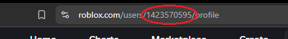
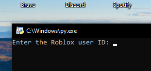
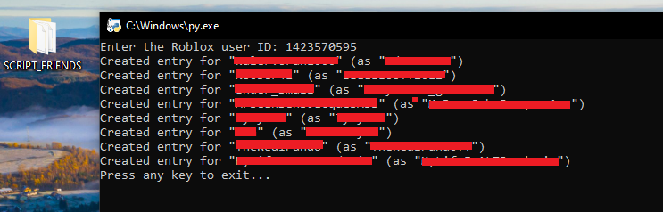
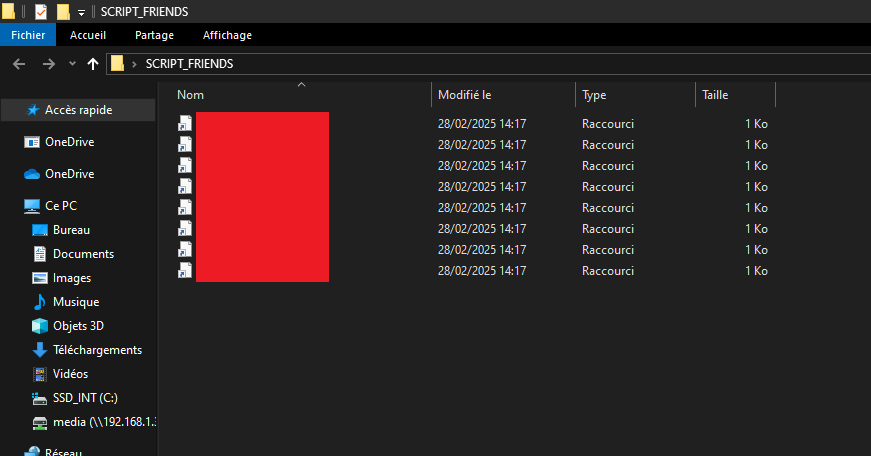

# Roblox-friends-api
## A python script that uses the roblox api to spit out a clean list of the desired user id's friends (BOTH THE MAIN.PY AND INSTALL_DEPENDENCIES.BAT ARE SAFE)

### USAGE (please execute install_dependencies.bat, it pip installs request, pywin32 and winshell)

### 1.

- Ensure you have python installed to the PATH and PIP is working

- Open install dependencies, no need to elevate it

### 2.

Go on [roblox.com](https://roblox.com)

Go on someone's profile and copy the numbers in the url bar (1423570595 for instance, which is PandemicFiber's profile)

### 3.

Open the main.py, it'll prompt you for a roblox id

Paste the Roblox User ID in the command prompt and press enter
    

### 4.

If it worked, you should have a folder on your desktop named SCRIPT_FRIENDS/an output from the terminal

There now should be openable links that leads to the friend's roblox profile

You can now press Enter to close the terminal
    

##### you can thank chatgpt lmao
