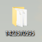

# Roblox-friends-api
## A python script that uses the roblox api to spit out a clean list of the desired user id's friends

### USAGE (please execute [install_dependencies.bat](https://github.com/PandoffYT/Roblox-friends-api/blob/main/install_dependencies.bat) before executing the main.py, both files are harmless)
#### (The output limit is 200, this limitation comes from roblox's api, i'll dive deeper and i'll try to bypass that restriction)

### 1.

- Ensure you have python installed to the PATH and PIP is working

- Open [install_dependencies.bat](https://github.com/PandoffYT/Roblox-friends-api/blob/main/install_dependencies.bat), no need to elevate it

### 2.

Go on [roblox.com](https://roblox.com)

Go on someone's profile and copy the numbers in the url bar (1423570595 for instance, which is PandemicFiber59's profile)

### 3.

Open the [main.py](https://github.com/PandoffYT/Roblox-friends-api/blob/main/main.py), it'll prompt you for a roblox id

Paste the Roblox User ID in the command prompt and press enter
    

### 4.

If it worked, you should have a folder on your desktop named with the target user's id/an output from the terminal

(example here from 1423570595, PandemicFiber59's account)

There now should be openable links that leads to the friend's roblox profile

You can now press Enter to close the terminal
    

##### you can thank chatgpt lmao
